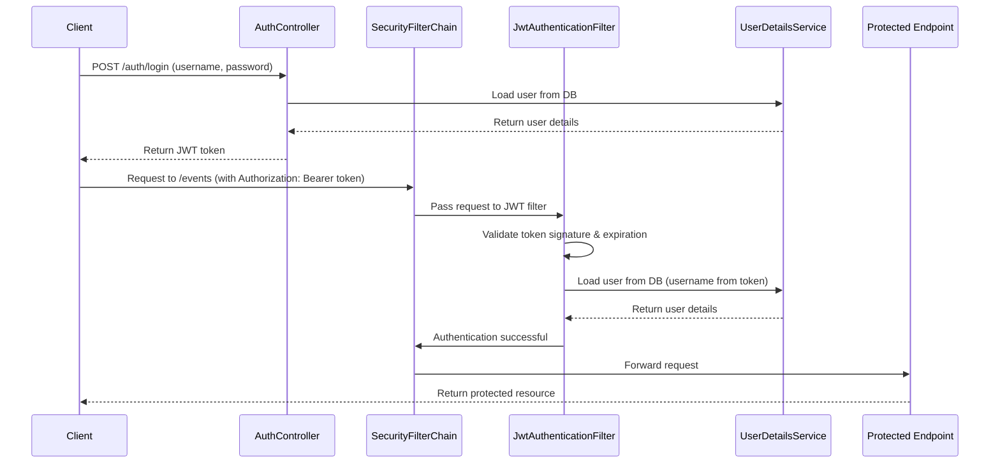

# US5 Complete Documentation – Error Handling, JWT Security, Roles & Architecture

---

## 1. Standard Error Format (RFC 7807)

The system uses **Spring Boot ProblemDetail** to return standardized error responses.

Each error contains:

- **type** – URL identifying the category of the error
- **title** – human‑readable short description
- **status** – HTTP status code
- **detail** – specific error message
- **instance** – endpoint where the error occurred
- **timestamp** – date and time of the error
- **traceId** – unique ID for log correlation

### Example Error Response

```json
{
  "type": "https://api.events-management.com/errors/400",
  "title": "Bad Request",
  "status": 400,
  "detail": "name: Event name is required",
  "instance": "/events",
  "timestamp": "2025-12-01T12:51:22Z",
  "traceId": "83f1da3c-aabf-4c7c-a756-2df48975ad33"
}
```

---

## 2. Advanced Validations

### ✔ Simple Validations
- @NotBlank
- @NotNull
- @Positive
- @Min
- @Size

### ✔ Validation Groups
- `Create`
- `Update`

### ✔ Cross-field Validation
EventRequest includes:

```
@ValidDateRange
```

Which ensures:

```
startDate < endDate
```

VenueRequest includes capacity consistency validation.

---

## 3. Role Structure

| Role        | Permissions |
|-------------|-------------|
| **ROLE_ADMIN** | Create Events, Delete Events, Create Venues, Delete Venues |
| **ROLE_USER**  | View Events, View Venues |

Roles are stored in the database and loaded via UserDetailsService.

---

## 4. JWT Authentication

Authentication is **stateless** and uses JSON Web Tokens.

### 4.1 Register

**POST /auth/register**

```json
{
  "username": "john",
  "password": "123456"
}
```

Returns:

```
User registered successfully
```

---

### 4.2 Login

**POST /auth/login**

```json
{
  "username": "john",
  "password": "123456"
}
```

Returns a JWT token:

```
eyJhbGciOiJIUzI1NiJ9...
```

---

### 4.3 Authorization Header

All protected endpoints require:

```
Authorization: Bearer <JWT>
```

---

## 5. Access Control via Roles

Example: Only ADMIN can create events.

```java
@PreAuthorize("hasRole('ADMIN')")
```

---

## 6. CORS & REST Security

The API includes global CORS configuration to allow:

- All methods (GET, POST, PUT, DELETE)
- Authorization header (for JWT)
- Exposure of `X-Trace-Id`

The system operates in **stateless mode** using:

```
SessionCreationPolicy.STATELESS
```

---

## 7. Full Flow Example

1. Register user
2. Login and obtain JWT
3. Include JWT in Authorization header
4. Access protected endpoints depending on role
5. Errors return RFC 7807 JSON structure with traceId

---

# 8. Architecture Diagram (Mermaid)

```mermaid
flowchart TD

A[Controller Layer
(EventRestAdapter, VenueRestAdapter, AuthController)] 
--> B[Application Layer
Use Cases]

B --> C[Domain Layer
Entities & Ports]

A --> D[Security Layer
JWT Filter, SecurityConfig]

C --> E[Infrastructure Layer
JPA Adapters, Mappers, Exception Handler]

D --> F[JWT Utility
Token Generation & Validation]

E --> G[Database]
```

---

# 9. Endpoint Access Table

| Endpoint | Method | Description | Public | Requires JWT | Role |
|----------|--------|-------------|--------|--------------|------|
| **/auth/register** | POST | Register new user | ✔ | ❌ | — |
| **/auth/login** | POST | Authenticate and generate JWT | ✔ | ❌ | — |
| **/events** | GET | List events | ❌ | ✔ | USER / ADMIN |
| **/events/{id}** | GET | Get event by ID | ❌ | ✔ | USER / ADMIN |
| **/events** | POST | Create event | ❌ | ✔ | ADMIN |
| **/events/{id}** | DELETE | Delete event | ❌ | ✔ | ADMIN |
| **/venues** | GET | List venues | ❌ | ✔ | USER / ADMIN |
| **/venues/{id}** | GET | Get venue by ID | ❌ | ✔ | USER / ADMIN |
| **/venues** | POST | Create venue | ❌ | ✔ | ADMIN |
| **/venues/{id}** | DELETE | Delete venue | ❌ | ✔ | ADMIN |

---

# 10. JWT Login & Validation Flow (Mermaid Diagram)



---

# End of Document
